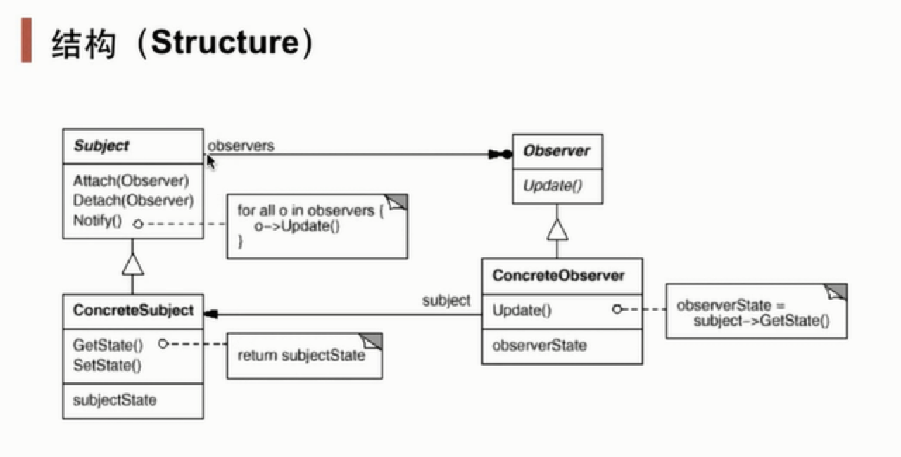

# 开闭原则:

1. 软件中的对象（类，模块，函数等等）应该对于扩展是开放的，但是对于修改是封闭的
2. 用抽象构建框架,用实现扩展细节 
3. 有点提高可复用性和可维护性

# 依赖倒置原则:

- 定义:高层模块不应该依赖低层模块,二者都应该依赖其抽象
- 抽象不应该依赖细节;细节应该依赖抽象
- 针对接口编程,不要针对实现编程
- 优点:可以减少类间的耦合性,提高系统稳定性,提高代码可读性可维护性,可降低修改程序造成的风险

# 单一职责原则:

- 定义:不要存在多于一个导致类变更的原因
- 一个类/接口/方法只负责一项职责
- 优点:降低类的复杂度、提高类的可读性性、提高系统的可维护性、降低变更引起的风险

# 接口隔离原则

- 定义:用于多个专门的接口,而不使用单一的总接口,客户端不应该依赖它不需要的接口
- 一个类对一个类的依赖应该建立在最小的接口上
- 建立单一的接口,不要建立庞大臃肿的接口
- 尽量细化接口,接口中的方法尽量少

# 迪米特原则

- 定义:一个对象应该对其他对象保持最少的了解(最少知道原则)
- 尽量降低类与类之间的耦合
- 优点:降低类之间的耦合
- 特点:强调只和朋友交流,不和陌生人说话

[^朋友]: 出现在成员变量、方法输出、输出参数中的类称为成员朋友类,出现在方法体内部的类不属于朋友类

------
# 观察者模式（Observer）
- 应用场景：对象间的一种一对多变化的依赖关系，以便当一个对象的状态发生改变时，所有的依赖于它的对象都得到通知并自动更新
  
------
# 策略模式(Strategy Pattern)
- 让算法和对象分开来,使得算法可以独立于使用它的客户而变化
- 使用情况
1. 许多相关的类仅仅是行为有异。“策略”提供了一种用多个行为中的一个行为来配置一个类的方法。即一个系统需要动态地在几种算      选择    一种。
2. 需要使用一个算法的不同变体。例如，你可能会定义一些反映不同的空间/时间权衡的算法。当这些变体实现为一个算法的类层次              时，可以使用策略模式。
3. 算法使用客户不应该知道的数据。可使用策略模式以避免暴露复杂的、与算法相关的数据结构。
4. 一个类定义了多种行为，并且这些行为在这个类的操作中以多个条件语句的形式出现。将相关的条件分支移入它们各自的Strategy      类    中以代替这些条件语句。 

